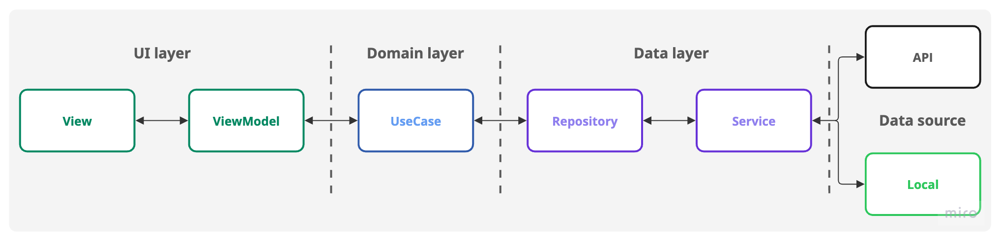

# 🍿 Popcorn


### Description:
A Flutter showcase project that demonstrates building a modern, responsive movie application. The app displays a list of movies, allows users to view detailed information for each movie, and supports adding movies to a favorites list.

### Key Features:
- 🎬 **Movie List & Details:** Browse movies and view detailed information (e.g., title, poster, overview, rating).
- ⭐ **Favorites:** Add or remove movies from a personalized favorites list.
- 🔍 **Search:** Search movies by title with real-time filtering.
- ♾️ **Infinite Scrolling:** Automatically load more movies as the user scrolls.
- 🌗 **Light & Dark Mode:** Seamless support for both light and dark themes.
- 🔄 **Orientation Support:** Fully responsive in both portrait and landscape modes.
- ⚠️ **Error Handling:** Graceful error states with retry options (e.g., network or API errors).

### Localization (l10n):
- 🇺🇸 **English (en-US):** Default language for displaying the app in English (United States).
- 🇹🇭 **Thai (th):** Fully localized interface for displaying the app in Thai.

### Resources
- 🛜 API: [Postman](https://web.postman.co/workspace/My-Workspace~94c84642-3586-4a80-80ae-6c2617f4dc71/collection/959004-71310e02-3019-4a37-9220-2e1552cb8b86?action=share&source=copy-link&creator=959004) (Invite Only)
- 🎨 Design: [Figma](https://www.figma.com/design/VXlZHO3zFTqOI8rIzXotQI/Popcorn?node-id=0-1&t=PCyZHd6Vb2qx76Ho-1)
- 📝 Project Home: [Notion](https://www.notion.so/Getting-Started-2a7a844fb94280248131cfc412c604cb?)
- 📄 Specification: [Notion](https://www.notion.so/Flutter-Movie-Showcase-App-Detailed-Specification-2a7a844fb942803fbf1adb65582bd98b)
- 👨‍🔬 Test Case: [Notion](https://www.notion.so/Test-cases-2a7a844fb94280f0b2f3ddfd72b799c8?)
- 🎬 Sprint Board: [Linear](https://linear.app/popcorn-flutter/team/POP/all) (Invite Only)
- 👨🏻‍💻 My profile: [Drive](https://docs.google.com/document/d/1PjG_kUpry4AqWKVEw0VV02HCih3igUJII3NR1A8qXlI/)
---

## ⚙️ Prerequisite
This application uses **The Movie Database (TMDb) API**.
To get started, visit the [TMDb Developer Portal](https://developer.themoviedb.org/docs/getting-started) and obtain an `API token`.
Once you have your token, update the API_TOKEN value in:.
```bash
popcorn/lib/data/services/service_config.dart
```
```dart
abstract final class ServiceConfig {
  static const apiToken = ''; // update the api token here
}
```
---
## 📁 Project Structure


### Overview of project structure
[Separation-of-concerns](https://en.wikipedia.org/wiki/Separation_of_concerns) is a key principle followed in this Flutter app to ensure maintainability, testability, and scalability. 

The app is organized into **three main layers:**
- **UI Layer:** Responsible for presenting data and handling user interactions.
- **Domain Layer:** Contains business logic and application rules. 
- **Data Layer:** Manages data retrieval, storage, and communication with external sources (e.g., APIs, local storage).

Each layer is further divided into distinct components, each with clear responsibilities, well-defined interfaces, and controlled dependencies:
- **Views:** Flutter widgets responsible for the presentation of UI.
- **ViewModels:** Handle UI state and communicate between Views and UseCases.
- **UseCases:** Encapsulate specific business logic and application operations.
- **Repositories:** Abstract data sources and provide a unified interface for UseCases.
- **Services:** Manage external integrations such as APIs, local storage, or network operations.

This structure ensures that changes in one part of the app have minimal impact on other layers, making the codebase easier to maintain and extend.

### File structure

```
popcorn/
├── lib/
│   ├── main.dart
│   ├── data/
│   │   ├── model/          # Data models used by repositories and services
│   │   ├── repository/     # Repositories abstract data sources and provide a unified interface to domain layer
│   │   └── service/        # Services for API calls, local storage, and other external integrations
│   ├── domain/
│   │   ├── mapper/         # Convert between data and domain models
│   │   ├── model/          # Domain-level models used in business logic
│   │   └── use_case/       # Encapsulate business logic operations
│   └── presentation/
│       └── {{feature}}/    # Feature-specific UI layer
│           ├── {{feature}}_screen.dart       # Widget displaying the UI
│           └── {{feature}}_view_model.dart   # Handles UI state and communicates with UseCases
├── pubspec.yaml            # Project configuration and dependencies
└── README.md               # Project documentation

```
---

## 📲 Run the project
Ensure that an emulator or physical device is running before launching the app.

### Development environment
This environment retrieves data from the `/assets/*.json` files and does not require a network connection. It contains only sample data for demonstration purposes.
```bash 
$ cd popcorn
$ flutter run --target lib/main_development.dart
```

### Staging environment
This environment retrieves data from the **The Movie Database (TMDb)** API and requires a network connection.
```bash 
$ cd popcorn
$ flutter run --target lib/main_staging.dart
```
---
## 🧪 Test the Project
### Golden test
Golden tests in Flutter help ensure visual consistency by comparing the rendered UI against reference images, known as golden images.

#### Capture New Golden Images
```bash 
$ cd popcorn
$ flutter test --update-goldens
```
### Unit test
This test also runs a **golden test** to verify the widget’s appearance against the reference _golden image_.
```bash 
$ cd popcorn
$ flutter test
```

### Integration Tests
Ensure that an emulator or physical device is running before executing the integration tests.
The integration tests use the **development environment** and do not require a network connection, as they rely on local sample data.

```bash
cd popcorn
$ flutter test integration_test
```
---

## 🛠️ Development Tools & Commands
The project includes a set of development commands and tools to improve the developer experience

### Format Code
Code formatting to automatically format Dart/Flutter code.
```bash
$ cd popcorn
$ dart format lib
```
### Analyze code
Code analyze to enforce consistent coding style
```bash
$ cd popcorn
$ flutter analyze
```

### Run build runner
Other utility scripts to simplify common development workflows.
- Create JSON phraser objects
- Create mock classes for unit test
```bash
$ cd popcorn
$ dart run build_runner build
```

### Update l10n
Generate/update the l10n files.
```bash
$ cd popcorn
$  flutter gen-l10n
```
